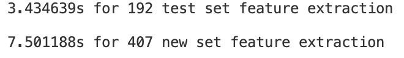
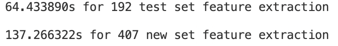
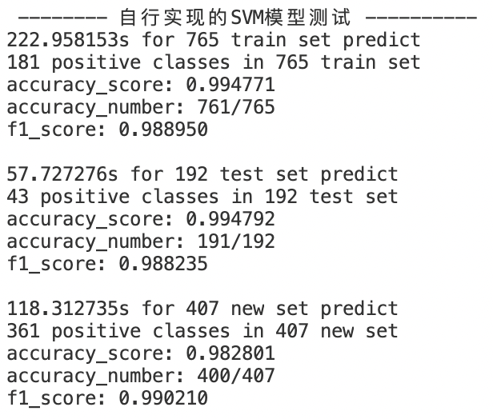

### SVM Scratch

训练代码使用Python，测试代码将使用C++重写

#### 1 SVM的参考代码
参考sklearn的Python和C++的代码实现了SVM测试部分的python代码，基本无任何包依赖，可较方便地改写为C++代码集成到项目中，主要参考代码如下：
+ [sklearn/svm/_libsvm.pxi](https://github.com/scikit-learn/scikit-learn/blob/main/sklearn/svm/_libsvm.pxi#L9)
+ [sklearn/svm/_libsvm.pyx](https://github.com/scikit-learn/scikit-learn/blob/main/sklearn/svm/_libsvm.pyx#L283)
+ [sklearn/svm/src/libsvm/libsvm_helper.c](https://github.com/scikit-learn/scikit-learn/blob/main/sklearn/svm/src/libsvm/libsvm_helper.c#L114)
+ [sklearn/svm/src/libsvm/svm.h](https://github.com/scikit-learn/scikit-learn/blob/main/sklearn/svm/src/libsvm/svm.h#L46)
+ [sklearn/svm/src/libsvm/svm.cpp](https://github.com/scikit-learn/scikit-learn/blob/main/sklearn/svm/src/libsvm/svm.cpp#L2818)
+ [sklearn/utils/_cython_blas.pyx](https://github.com/scikit-learn/scikit-learn/blob/main/sklearn/utils/_cython_blas.pyx#L20)

2. hog的参考代码

另外还参考了skimage的Python和C++的代码实现了hog的python代码，主要参考代码如下：
+ [skimage/feature/_hog.py](https://github.com/scikit-image/scikit-image/blob/main/skimage/feature/_hog.py#L50)
+ [skimage/feature/_hoghistogram.pyx](https://github.com/scikit-image/scikit-image/blob/main/skimage/feature/_hoghistogram.pyx#L80)

3. 使用方法

+ 运行data2npy.py生成训练测试数据(包楠编写)
+ 运行svm_origin.py会训练与测试SVM模型并保存模型参数，调用的是sklearn的代码
+ 运行svm_ldy.py会加载模型参数进行测试，调用的是自行编写的代码

4. 对比

